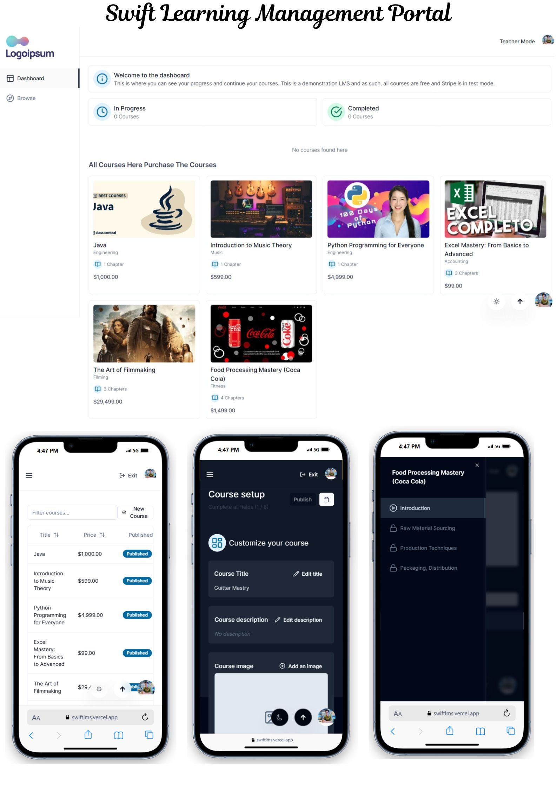

# SWIFT LMS Platform
### Project Live link https://swiftlms.vercel.app/ 
(click this project link and login to your gmail)

**Key Features:**

* Browse and filter courses
* Purchase courses using Paypal (working on)
* Mark chapters as completed or uncompleted
* Progress calculation of each course
* Student dashboard
* Teacher mode (admin Cntrol)
* Create new courses
* Create new chapters
* Easily reorder chapter position with drag and drop
* Upload thumbnails, attachments, and videos using UploadThing
* Video processing using Mux 
* HLS Video player using Mux
* Rich text editor for chapter description
* Authentication using Clerk
* ORM using Prisma
* MySQL database using AWS RDS

**Deployment:**
this application development using services 

- Vercel https://vercel.com (for server-less hosting.)

- Mux https://mux.com - ( for Videos storage and Processing )

- Clerk https://clerk.com (Authentication Services)

- UploadThing https://uploadthing.com/ (for serverless upload storage.)

- AWS RDS https://aws.amazon.com/ (Realation Database system/ MYSQL)

### Project Live link https://swiftlms.vercel.app/ 
(click this project link and login to your gmail)
